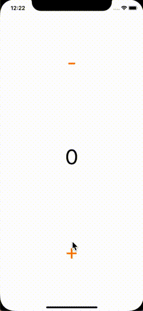

# Elm Button Sample implemented with Swift

This is a swift implementation of [Buttons sample](https://guide.elm-lang.org/architecture/buttons.html) in Elm Official Guide.  
For simplicity, [commands and subscriptions](https://guide.elm-lang.org/effects/) are not included.(They are included in the [v2](https://github.com/yoching/SwiftElmSample2).)  
Also, incremental updates of views are not implemented.  
(If you want to know them, please refer to [referenced materials](#References).)  

I hope this will be a help to start learning The Elm Architecture with swift!



## AppState
This corresponds to the [Buttons sample](https://guide.elm-lang.org/architecture/buttons.html) in Elm Official Guide.
```swift
struct AppState {

    // MODEL
    var value: Int

    // UPDATE
    enum Message {
        case increment
        case decrement
    }

    mutating func update(_ message: Message) {
        switch message {
        case .increment:
            value = value + 1
        case .decrement:
            value = value - 1
        }
    }

    // VIEW
    var viewController: ViewController<Message> {
        return ._viewController(
            .stackView(
                views: [
                    .button(text: "-", onTap: .decrement),
                    .label(text: "\(value)"),
                    .button(text: "+", onTap: .increment)
                ],
                axis: .vertical,
                distriburtion: .fillEqually
            )
        )
    }
}
```


## References
- [2nd version](https://github.com/yoching/SwiftElmSample2)
- App Architecture from objc.io
  - [book & video](https://www.objc.io/books/app-architecture/)
  - [sample codes](https://github.com/objcio/app-architecture)
    - especially, Recordings-TEA & One-App-Eight-Architectures
